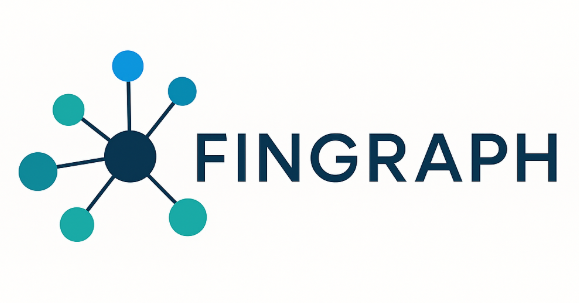

# FINGRAPH

financial knowledge graph for systemic risk and contagion analysis




---

## 🌐 overview

FinGraph is a production ready python project that models the network of companies, sectors, and supply chains as a graph. by representing entities as nodes and relationships as edges, FinGraph allows users to analyze systemic risk, sector contagion, and hidden dependencies in financial ecosystems

this project bridges finance, data science, and network analysis, giving you insights that go far beyond traditional spreadsheets and dashboards


---

## 🕸️ features

- graph construction: build a graph of companies and their supply-chain relationships

- centrality metrics: identify systemically important companies using PageRank, betweenness, and eigenvector centrality
 
- community detection: detect clusters of companies using the Louvain algorithm

- contagion simulation: simulate financial shocks through the network to see ripple effects

- interactive visualization: explore the network with PyVis interactive graphs


---


## ⚙️ how does it work?
FinGraph models the financial ecosystem as a **graph of companies and supply-chain relationships**. here's the high-level workflow:

1. **data loading (ETL):**  
   - company metadata (`ticker`, `name`, `sector`, `country`, `market_cap`) is loaded  
   - supply-chain relationships (`supplier → customer`) are read as edges

2. **graph construction:**   
   - entities become **nodes** and relationships become **edges** in a NetworkX graph  
   - additional metrics (centrality, community membership) are attached to nodes

3. **Network Analysis:**  
   - **centrality metrics** (pagerank, betweenness, eigenvector) identify systemically important companies  
   - **community detection** (louvain algorithm) finds clusters of interconnected firms

4. **Contagion Simulation:**  
   - financial shocks are simulated starting from chosen seed nodes
   - risk spreads along edges with a decay factor, producing a **risk score** for each company  

5. **Visualization:**  
   - nodes are colored based on simulated risk: **green → yellow → red**
   - interactive graphs allow exploration of systemic risk, sector contagion, and hidden dependencies

this pipeline transforms raw financial data into an actionable **knowledge graph**, enabling analysts and researchers to spot vulnerabilities and understand complex interconnections in financial networks


---

## 🛠️ tech stack

- python

- networkX: graph construction & analysis

- python-Louvain: community detection

- PyVis: interactive graph visualization

- pandas & numpy: data handling and processing

- matplotlib & seaborn: static plotting

- jupyter notebook: demo & exploration


---


## ⚙️ workflow

ETL ---> graph ---> analytics ---> visualization

---

## 🚀 getting started

1. **clone the repo**

```bash```

- git clone https://github.com/Youcef3939/FinGraph.git

- cd FinGraph

2. **install dependencies**

- pip install -r requirements.txt

3. **run the demo notebook**

- open /notebooks/demo.ipynb in jupyter to:

    . load data

    . build the graph

    . run centrality & community detection

    . visualize the network interactively


---

## 🔬 exemple visualization

interactive network graph:


---

## 💡 future upgrades

| Upgrade                   | Benefit                                                     |
| ------------------------- | ----------------------------------------------------------- |
| **Neo4j / TigerGraph DB** | Scalable queries on millions of nodes & edges               |
|                           |                                                             |        
| **API Layer (FastAPI)**   | Expose analytics & simulations for external apps            |
|                           |                                                             |        
| **Real-time ETL**         | Pull live data from Yahoo Finance, GDELT, OpenCorporates    |
|                           |                                                             |  
| **Streamlit Dashboard**   | Interactive front-end for non-technical users               |
|                           |                                                             |        
| **Graph ML / Embeddings** | Predict future links, detect anomalies, compute risk scores |
|                           |                                                             |
| **Dockerization**         | Fully containerized, deploy anywhere                        |


---

## ⚡ why FinGraph

it transorms raw financial data into a dynamic, analyzable network thus enabling:

- identification of hidden dependecies

- simulation of cascading failures in supply chains

- detection of systemically important companies before a crisis

- integration of news sentiment & events for real time insights

---

## 🙏 acknowledgments & inspiration

FinGraph was inspired by the growing need to visualize and analyze financial ecosystems as networks, uncover hidden dependencies, and anticipate systemic risks

special thanks to:

- networkX & python-Louvain developers for making graph analytics accessible

- PyVis for enabling beautiful interactive graph visualizations

- open-source data communities like yahoo finance, opencorporates, and GDELT for financial and corporate data

- the broader financial analytics and graph ML communities whose research and tools inspired the core idea behind FinGraph

if you used FinGraph or found it useful, consider starring the repo and contributing, your feedback helps make it better <3 

---

IT'S THE ULTIMATE TOOL FOR ANALYSTS, RESEARCHERS, AND FINANCE PROFESSIONALS WHO WANT A DEEPER UNDERSTANDING OF FINANCIAL ECOSYSTEMS!   
